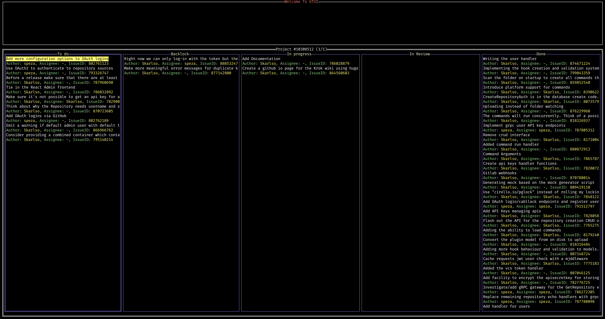
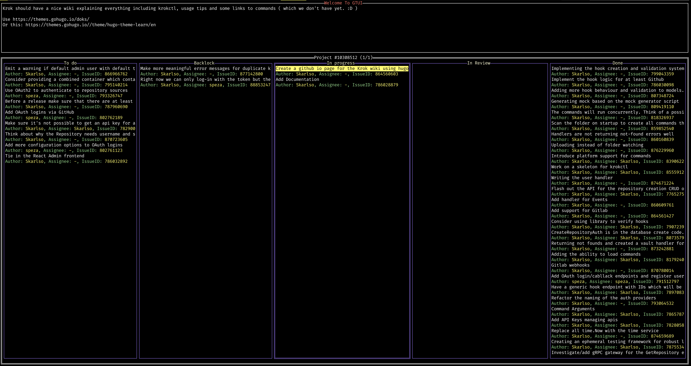
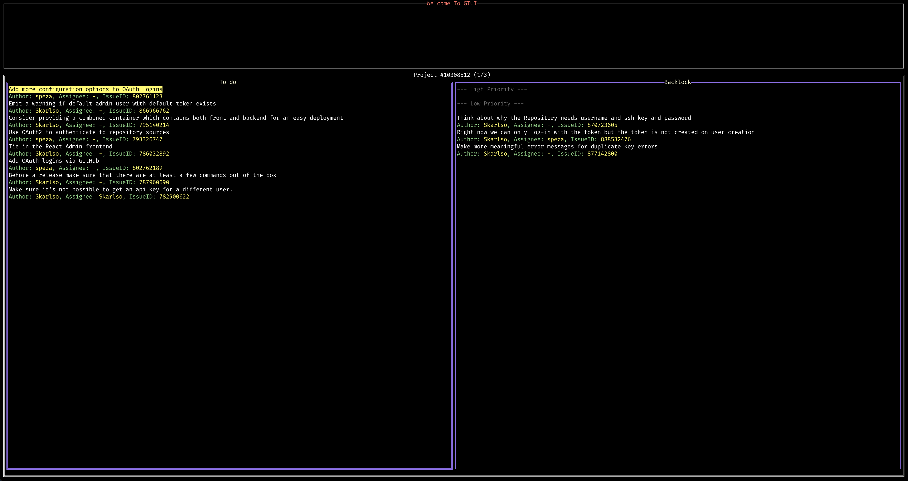
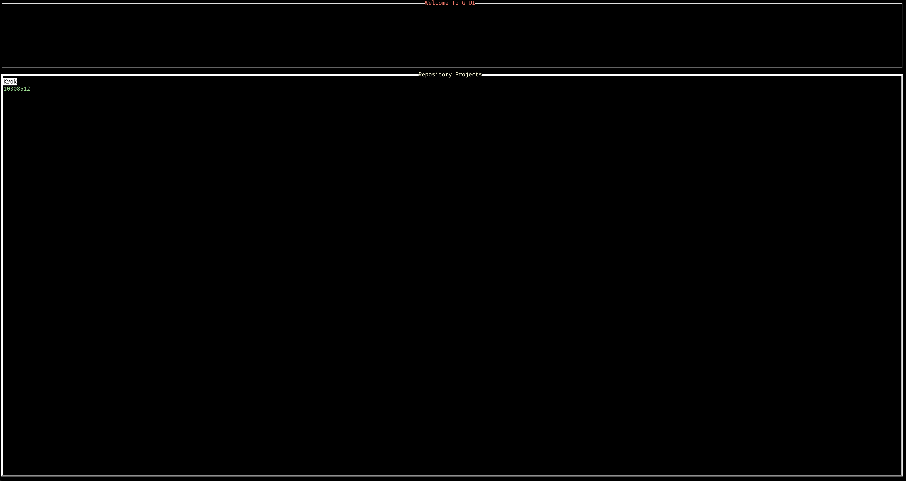
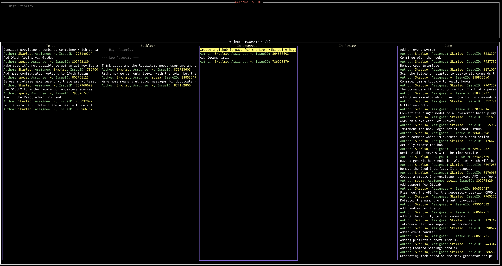
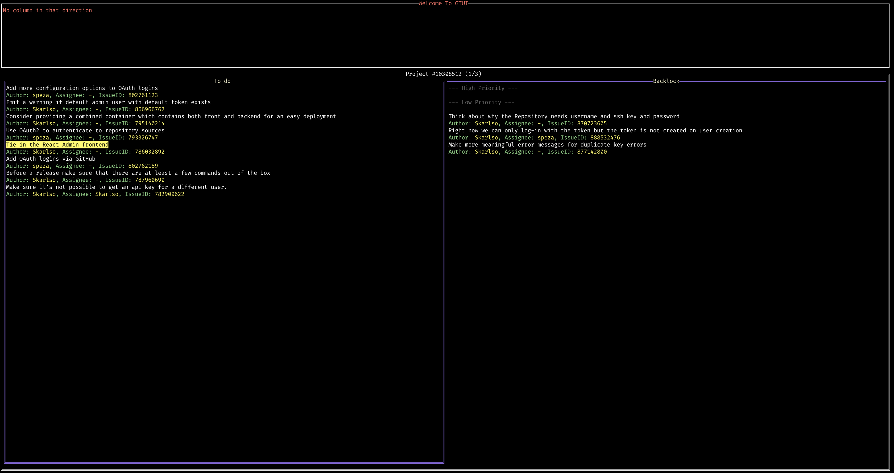

# GTUI

[](https://goreportcard.com/report/github.com/Skarlso/gtui)

This is a Terminal UI for working with GitHub Projects.



## Features

Right now this isn't even alpha, so there are a basic set of features available. Moving along the columns happens by
pressing `<TAB>`. By hitting `<ENTER>` the issue's description appears in the status window like this:



### Pagination of columns

When there are too many columns to fit nicely into a single terminal window, you can lower the number of columns
to display per window. This looks like this:

```
gtui --project-id 12345 --columns-per-page 2
```

In which case, the Project title will display the currently active page and how many pages of columns there are like this:



### Selecting Projects

If you don't know the project ID, you do one of two things:

- Provide an owner / organization and a repository with `--organization` and `--repository` and this will list all projects in that repository
from which you then can select one.
- Provide an organization only, which will list all projects for that organization.

For example doing this:

```
gtui --organization krok-o --repository krok
```

... will result in a view like this:



... from which once `<ENTER>` is hit on a project, it will load that up.

*NOTE*: It takes a little while to load in all cards for a project. It does do a single page fetch and then fetches the rest of the cards
in the background. But it can still take a couple seconds to load in everything.

### Directly opening a project with project ID

If you already know that ID of the project, simply run gtui with `--project-id` directly.

```
gtui --project-id 123456
```

### Moving cards

It's possible to move cards between columns with the following shortcuts:

- Ctrl+k -> move current selected card to the right of the current column
- Ctrl+j -> move current selected card to the left of the current column

### Notes and Issue cards

Notes and issues show up differently in different colors like this:



### Status

Various status information like, errors and such, are displayed in the top area. This is where
the body of cards is displayed as well when one hits enter on a card.



### TODO

- [ ] Same ordering of issues as on the project view
- [ ] Background sync of the board to display updates
- [ ] CRUD operations for cards such as Close issue, Edit issue labels, create cards etc
- [ ] Themes

## Contributions

Are always welcomed in any form.
